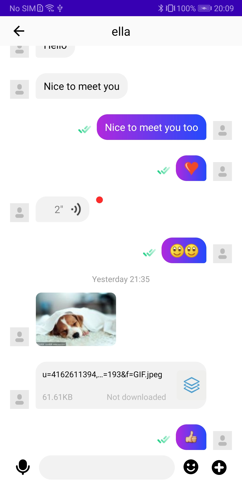
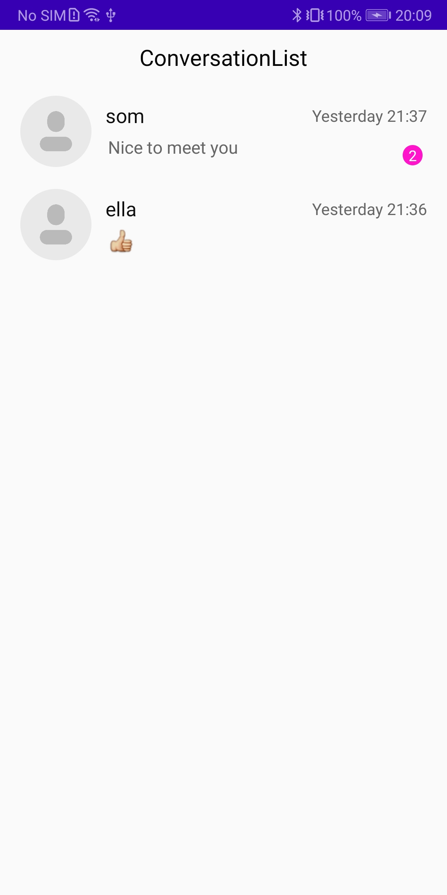
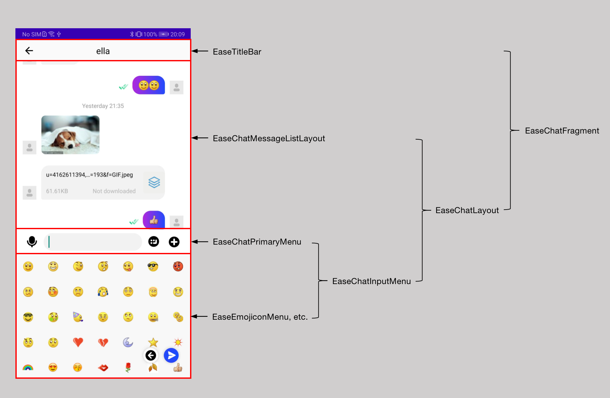

# Agora Chat UIKit 使用指南

## 导入 Agora Chat UIKit
### 开发环境要求
- Android Studio 3.2 及以上
- Gradle 4.6 及以上
- targetVersion 26 及以上
- Android SDK API 19 及以上
- Java JDK 1.8 及以上

### 集成说明
Agora Chat UIKit 支持Gradle接入和 Module源码集成

#### Gradle接入集成
在项目根目录的 build.gradle 文件中添加 MavenCentral 远程仓库。
```java
buildscript {
    repositories {
        ...
        mavenCentral()
    }
}
allprojects {
    repositories {
        ...
        mavenCentral()
    }
}
```

在项目的 /app/build.gradle 文件添加 chat-uikit 依赖项（X.Y.Z 为当前版本号）。你可以在 [Sonatype](https://search.maven.org/) 官网查询最新版本号。
```java
android {
    
    compileOptions {
        sourceCompatibility JavaVersion.VERSION_1_8
        targetCompatibility JavaVersion.VERSION_1_8
    }
}
dependencies {
    ...
        implementation 'io.agora.rtc:chat-uikit:X.Y.Z'
}
```
#### Module源码集成
从 github 获取 [Agora Chat UIKit](https://github.com/AgoraIO-Usecase/AgoraChat-UIKit-android) 源码，按照下面的方式集成：

```java
implementation project(':uikit')
```

#### 防止代码混淆
在 app/proguard-rules.pro 文件中添加如下行，防止代码混淆：
```java
-keep class io.agora.** {*;}
-dontwarn  io.agora.**
```
### 权限
```xml
<!-- IM SDK required start -->
<!-- 允许程序振动，用于本地通知设置振动 -->
<uses-permission android:name="android.permission.VIBRATE" />
<!-- 访问网络权限 -->
<uses-permission android:name="android.permission.INTERNET" />
<!-- 麦克风权限，用于语音消息时录制语音，不使用录制语音可以移除 -->
<uses-permission android:name="android.permission.RECORD_AUDIO" />
<!-- 相机权限，用于图片消息时拍摄图片，不使用拍照可以移除 -->
<uses-permission android:name="android.permission.CAMERA" />
<!-- 获取运营商信息，用于获取网络状态 -->
<uses-permission android:name="android.permission.ACCESS_NETWORK_STATE"/>
<!-- 写入扩展存储权限，用于附件等的存储 -->
<uses-permission android:name="android.permission.WRITE_EXTERNAL_STORAGE"/>
<!-- 访问GPS定位，用于定位消息，如果不用定位相关可以移除 -->
<uses-permission android:name="android.permission.ACCESS_FINE_LOCATION"/>
<!-- api 21后被标记为deprecated，可以移除 -->
<uses-permission android:name="android.permission.GET_TASKS" />
<!-- 允许程序在手机屏幕关闭后后台进程仍然运行 -->
<uses-permission android:name="android.permission.WAKE_LOCK" />
<!-- 允许程序开机自动运行 -->
<uses-permission android:name="android.permission.RECEIVE_BOOT_COMPLETED" />
<!-- IM SDK required end -->
```
### 初始化 Agora Chat SDK
使用 Agora Chat SDK 之前，需要初始化，可以使用 Agora Chat UIKit 提供的初始化方法 EaseUIKit#init 。
示例代码：
```java
public class DemoApplication extends Application {

    @Override
    public void onCreate() {
        super.onCreate();
        ChatOptions options = new ChatOptions();
        options.setAppKey("Your AppKey");
        ... // Other options you want to set
        EaseUIKit.getInstance().init(this, options);
    }

}
```
注意：
- 如果您选择在 AndroidManifest.xml设置 appKey ，可以不在 Agora Chat SDK 的 ChatOptions 中配置，即如下：
```xml
<meta-data android:name="EASEMOB_APPKEY"  android:value="Your AppKey" />
```
- 如果两个地方都配置了，优先采用 ChatOptions 中的 appKey 配置。
## 快速搭建
### 快速创建聊天页面
Agora Chat UIKit 提供了 EaseChatFragment ，添加到 Activity 中并传递相应的参数即可使用。
示例如下：
```java
public class ChatActivity extends AppCompatActivity {

    @Override
    protected void onCreate(Bundle arg0) {
        super.onCreate(arg0);
        setContentView(R.layout.activity_chat);
        // conversationID: Agora Chat ID: 1v1 is peer's userID, group chat is groupID, chat room is chatRoomID
        // chatType can be EaseChatType#SINGLE_CHAT, EaseChatType#GROUP_CHAT, EaseChatType#CHATROOM
        getSupportFragmentManager().beginTransaction()
                                   .replace(R.id.fl_fragment, 
                                            new EaseChatFragment.Builder(conversationID, chatType)
                                                                .build())
                                   .commit();
    }
}
```
运行后，如下图：



### 快速创建会话列表页面
Agora Chat UIKit 提供了 EaseConversationListFragment ，添加到 Activity 中即可使用。
示例如下：
```java
public class ConversationListActivity extends AppCompatActivity {

    @Override
    protected void onCreate(Bundle arg0) {
        super.onCreate(arg0);
        setContentView(R.layout.activity_chat);
        getSupportFragmentManager().beginTransaction()
                                   .replace(R.id.fl_fragment,
                                            new EaseConversationListFragment.Builder()
                                                                .build())
                                   .commit();
    }
}
```
注意：如果接收到新消息，删除会话联系人等事件，需要调用 EaseConversationListFragment#refreshList 方法刷新列表。
运行后，如下图：



### 快速创建子区聊天页面
Agora Chat UIKit 提供了 EaseChatThreadActivity , 传递相应的参数启动 Activity 即可。
示例如下：
```java
Intent intent = new Intent(context, EaseChatThreadActivity.class);
// 子区所属父消息 ID。
intent.putExtra("parentMsgId", parentMsgId);
// 子区 ID。
intent.putExtra("conversationId", conversationId);
// 子区所属群组 ID。
intent.putExtra("parentId", parentId);
context.startActivity(intent);

// 或者调用如下方法
EaseChatThreadActivity.actionStart(context, conversationId, parentMsgId, parentId);
```

同时 Agora Chat UIKit 提供了 EaseChatThreadFragment ，开发者可以继承或者使用 EaseChatThreadFragment#Builder设置自定义的选项，并添加到 Activity 中并传递相应的参数即可使用。
示例如下：
```java
public class ChatThreadActivity extends AppCompatActivity {

    @Override
    protected void onCreate(Bundle arg0) {
        super.onCreate(arg0);
        setContentView(R.layout.activity_chat_thread);
        // parentMsgId: message thread's parent message ID
        // conversationID: Agora Chat ID: 1v1 is peer's userID, group chat is groupID, chat room is chatRoomID
        // parentId: group ID to which message thread belongs
        getSupportFragmentManager().beginTransaction()
                                   .replace(R.id.fl_fragment, 
                                            new EaseChatThreadFragment.Builder(parentMsgId, conversationID, parentId)
                                                                      .build())
                                   .commit();
    }
}
```
运行后，如下图：


### 快速创建子区页面
Agora Chat UIKit 提供了 EaseChatThreadCreateActivity , 传递相应的参数启动 Activity 即可。
示例如下：
```java
Intent intent = new Intent(context, EaseChatThreadCreateActivity.class);
// 子区所属父消息 ID。
intent.putExtra("parentMsgId", parentMsgId);
// 子区所属群组 ID。
intent.putExtra("parentId", parentId);
context.startActivity(intent);

// 或者调用如下方法
EaseChatThreadCreateActivity.actionStart(context, parentId, parentMsgId);
```

同时 Agora Chat UIKit 提供了 EaseChatThreadCreateFragment ，开发者可以继承或者使用 EaseChatThreadCreateFragment#Builder设置自定义的选项，并添加到 Activity 中并传递相应的参数即可使用。
示例如下：
```java
public class ChatThreadCreateActivity extends AppCompatActivity {

    @Override
    protected void onCreate(Bundle arg0) {
        super.onCreate(arg0);
        setContentView(R.layout.activity_chat_thread);
        // parentId: group ID to which message thread belongs
        getSupportFragmentManager().beginTransaction()
                                   .replace(R.id.fl_fragment, 
                                            new EaseChatThreadCreateFragment.Builder(parentId, parentMsgId)
                                                                            .build())
                                   .commit();
    }
}
```
运行后，如下图：


### 快速创建子区列表页面
Agora Chat UIKit 提供了 EaseChatThreadListActivity , 传递相应的参数启动 Activity 即可。
示例如下：
```java
Intent intent = new Intent(context, EaseChatThreadListActivity.class);
// 子区所属群组 ID。
intent.putExtra("parentId", parentId);
context.startActivity(intent);

// 或者调用如下方法
EaseChatThreadListActivity.actionStart(context, parentId);
```

同时 Agora Chat UIKit 提供了 EaseChatThreadListFragment ，开发者可以继承或者使用 EaseChatThreadListFragment#Builder设置自定义的选项，并添加到 Activity 中并传递相应的参数即可使用。
示例如下：
```java
public class ChatThreadListActivity extends AppCompatActivity {

    @Override
    protected void onCreate(Bundle arg0) {
        super.onCreate(arg0);
        setContentView(R.layout.activity_chat_thread);
        // parentId: group ID to which message thread belongs
        getSupportFragmentManager().beginTransaction()
                                   .replace(R.id.fl_fragment, 
                                            new EaseChatThreadListFragment.Builder(parentId)
                                                                          .build())
                                   .commit();
    }
}
```
运行后，如下图：


## 高级定制
### 聊天页面相关

聊天页面按照以下进行分区和命名：


#### 通过 EaseChatFragment.Builder 自定义设置
EaseChatFragment 提供了 Builder 构建方式，方便开发者进行一些自定义设置，目前提供的设置项如下：
```java
// conversationID: Agora Chat ID: 1v1 is peer's userID, group chat is groupID, chat room is chatRoomID
// 1: single chat; 2: group chat; 3: chat room
new EaseChatFragment.Builder(conversationID, SINGLE_CHAT)
        .useHeader(true)
        .setHeaderTitle("title")
        .enableHeaderPressBack(true)
        .setHeaderBackPressListener(onBackPressListener)
        .getHistoryMessageFromServerOrLocal(false)
        .setOnChatExtendMenuItemClickListener(onChatExtendMenuItemClickListener)
        .setOnChatInputChangeListener(onChatInputChangeListener)
        .setOnMessageItemClickListener(onMessageItemClickListener)
        .setOnMessageSendCallBack(onMessageSendCallBack)
        .setOnAddMsgAttrsBeforeSendEvent(onAddMsgAttrsBeforeSendEvent)
        .setOnChatRecordTouchListener(onChatRecordTouchListener)
        .setMsgTimeTextColor(msgTimeTextColor)
        .setMsgTimeTextSize(msgTimeTextSize)
        .setReceivedMsgBubbleBackground(receivedMsgBubbleBackground)
        .setSentBubbleBackground(sentBubbleBackground)
        .showNickname(false)
        .setMessageListShowStyle(EaseChatMessageListLayout.ShowType.LEFT_RIGHT)
        .hideReceiverAvatar(false)
        .hideSenderAvatar(true)
        .setChatBackground(chatBackground)
        .setChatInputMenuStyle(EaseInputMenuStyle.All)
        .setChatInputMenuBackground(inputMenuBackground)
        .setChatInputMenuHint(inputMenuHint)
        .sendMessageByOriginalImage(true)
        .setEmptyLayout(R.layout.layout_conversation_empty)
        .setCustomAdapter(customAdapter)
        .setCustomFragment(myChatFragment)
        .build();
```
EaseChatFragment#Builder 提供的方法解释：
| 方法                                    | 说明                                                 |
| -------------------------------------- | ---------------------------------------------------- |
| useHeader()                            | 是否使用默认的标题栏（EaseTitileBar），默认为 False        |
| setHeaderTitle()                       | 设置标题栏的标题                                        |
| enableHeaderPressBack()                | 设置是否支持显示返回按钮，默认为 False                     |
| setHeaderBackPressListener(）           | 设置点击标题栏返回按钮的监听事件                          |
| getHistoryMessageFromServerOrLocal(）   | 设置优先从服务器还是本地获取消息                          |
| setOnChatExtendMenuItemClickListener() | 设置扩展功能的条目点击事件监听                            |
| setOnChatInputChangeListener()         | 设置菜单中文本变化的监听                                 |
| setOnMessageItemClickListener()        | 设置消息条目的点击事件监听，包括气泡区域及头像的点击及长按事件  |
| setOnMessageSendCallBack()             | 设置发送消息的结果回调监听                                |
| setOnAddMsgAttrsBeforeSendEvent()      | 设置发送消息前添加消息扩展属性的回调                        |
| setOnChatRecordTouchListener()         | 设置录音按钮的触摸事件回调                                |
| setMsgTimeTextColor()                  | 设置时间线文本的颜色                                     |
| setMsgTimeTextSize()                   | 设置时间线文本的字体大小                                  |
| setReceivedMsgBubbleBackground()       | 设置接收消息气泡区域的背景                                |   
| setSentBubbleBackground()              | 设置发送消息气泡区域的背景                                |
| showNickname()                         | 是否显示昵称，默认为 False                               |
| setMessageListShowStyle()              | 设置消息列表的展示样式，分为 left_right 和 all_left 两种样式 |
| hideReceiverAvatar()                   | 设置不展示接收方头像，默认展示接收方头像                              |
| hideSenderAvatar()                     | 设置不展示发送方头像，默认展示发送方头像                              |
| setChatBackground()                    | 设置聊天列表区域的背景                                   |
| setChatInputMenuStyle()                | 设置菜单样式，详见 EaseInputMenuStyle                   |
| setChatInputMenuBackground()           | 设置菜单区域的背景                                      |
| setChatInputMenuHint()                 | 设置菜单区域输入文本框的提示文字                           |
| sendMessageByOriginalImage()           | 设置图片消息是否发送原图，默认为 False                     |
| setEmptyLayout()                       | 设置聊天列表的空白页面                                   |
| setCustomAdapter()                     | 设置自定义的适配器，默认为 EaseMessageAdapter             |
| setCustomFragment()                    | 设置自定义聊天Fragment，需要继承自 EaseChatFragment       |


#### 添加自定义消息布局
开发者可以继承 EaseMessageAdapter ， EaseChatRowViewHolder 和 EaseChatRow 实现自己的 CustomMessageAdapter ，CustomChatTypeViewViewHolder 和 CustomTypeChatRow ，然后将 CustomMessageAdapter 设置到 EaseChatFragment#Builder#setCustomAdapter 中。

（1）创建自定义适配器 CustomMessageAdapter 继承自 EaseMessageAdapter， 重写 getViewHolder 和 getItemNotEmptyViewType 方法。
```java
public class CustomMessageAdapter extends EaseMessageAdapter {

    @Override
    public int getItemNotEmptyViewType(int position) {
        // 根据消息类型设置自己的 itemViewType。
        // 如果要使用默认的，返回 super.getItemNotEmptyViewType(position) 即可。
        return CUSTOM_YOUR_MESSAGE_TYPE;
    }

    @Override
    public ViewHolder<ChatMessage> getViewHolder(ViewGroup parent, int viewType) {
        // 根据返回的 viewType 返回对应的 ViewHolder。
        // 返回自定义的 ViewHolder 或者 使用默认的 super.getViewHolder(parent, viewType)
        return new CUSTOM_VIEWHOLDER();
    }
}
```
（2）创建 CustomTypeChatRow ，继承自 EaseChatRow 。
```java
public class CustomTypeChatRow extends EaseChatRow {
    private TextView contentView;

    public CustomTypeChatRow(Context context, boolean isSender) {
        super(context, isSender);
    }

    @Override
    protected void onInflateView() {
        inflater.inflate(!showSenderType ? R.layout.layout_row_received_custom_type
                : R.layout.layout_row_sent_custom_type, this);
    }

    @Override
    protected void onFindViewById() {
        contentView = (TextView) findViewById(R.id.tv_chatcontent);
    }

    @Override
    protected void onSetUpView() {
        TextMessageBody txtBody = (TextMessageBody) message.getBody();
        if(txtBody != null){
            contentView.setText(txtBody.getMessage());
        }
    }
}
```
（3）创建 CustomChatTypeViewViewHolder ，继承自 EaseChatRowViewHolder 。
```java
public class CustomChatTypeViewViewHolder extends EaseChatRowViewHolder {

    public CustomChatTypeViewViewHolder(@NonNull View itemView, MessageListItemClickListener itemClickListener) {
        super(itemView, itemClickListener);
    }

    @Override
    public void onBubbleClick(ChatMessage message) {
        super.onBubbleClick(message);
        // Add click event
    }

}
```
（4）完善 CustomMessageAdapter 。
```java
public class CustomMessageAdapter extends EaseMessageAdapter {
    private static final String CUSTOM_TYPE = "custom_type";
    private static final int VIEW_TYPE_MESSAGE_CUSTOM_VIEW_ME = 1000;
    private static final int VIEW_TYPE_MESSAGE_CUSTOM_VIEW_OTHER = 1001;

    @Override
    public int getItemNotEmptyViewType(int position) {
        ChatMessage chatMessage = mData.get(position);
        String type = chatMessage.getStringAttribute("type", "");
        if(TextUtils.equals(type, CUSTOM_TYPE)) {
            if(chatMessage.direct() == ChatMessage.Direct.SEND) {
                return VIEW_TYPE_MESSAGE_CUSTOM_VIEW_ME;
            }else {
                return VIEW_TYPE_MESSAGE_CUSTOM_VIEW_OTHER;
            }
        }
        return super.getItemNotEmptyViewType(position);
    }

    @Override
    public ViewHolder<ChatMessage> getViewHolder(ViewGroup parent, int viewType) {
        if(viewType == VIEW_TYPE_MESSAGE_CUSTOM_VIEW_ME || viewType == VIEW_TYPE_MESSAGE_CUSTOM_VIEW_OTHER) {
            return new CustomChatTypeViewViewHolder(
                    new CustomTypeChatRow(parent.getContext(), viewType == VIEW_TYPE_MESSAGE_CUSTOM_VIEW_ME),
                    listener);
        }
        return super.getViewHolder(parent, viewType);
    }
}
```
（5）添加 CustomMessageAdapter 到 EaseChatFragment#Builder。
```java
builder.setCustomAdapter(customMessageAdapter);
```
#### 通过继承 EaseChatFragment 进行自定义设置
创建自定义 CustomChatFragment  ，继承自 EaseChatFragment ，并设置到 EaseChatFragment#Builder 中。
```java
builder.setCustomFragment(customChatFragment);
```
（1）列表控件相关功能设置
获取 EaseChatMessageListLayout 对象：
```java
EaseChatMessageListLayout chatMessageListLayout = chatLayout.getChatMessageListLayout();
```
EaseChatMessageListLayout 提供了如下方法：
| 方法                            | 说明                                                 |
| ------------------------------ | ---------------------------------------------------- |
| setPresenter()                 | UIKit 中提供了默认的数据实现 EaseChatMessagePresenterImpl，开发者可以继承 EaseChatMessagePresenter 添加自己的数据逻辑 |
| getMessageAdapter()            | 返回消息列表的适配器 |
| addHeaderAdapter()             | 添加消息列表的头布局的适配器 |
| addFooterAdapter()             | 添加消息列表的尾布局的适配器 |
| removeAdapter()                | 移除指定适配器 |
| addRVItemDecoration()          | 添加消息列表的装饰器 |
| removeRVItemDecoration()       | 移除消息列表的装饰器 |
| setAvatarDefaultSrc()          | 设置条目的默认头像 |
| setAvatarShapeType()           | 设置头像的样式，分为默认ImageView样式，圆形和矩形三种样式 |
| showNickname()                 | 是否展示条目的昵称，EaseChatFragment#Builder 也提供了此功能的设置方法         |
| setItemSenderBackground()      | 设置发送方的背景，EaseChatFragment#Builder 也提供了此功能的设置方法           |
| setItemReceiverBackground()    | 设置接收方的背景，EaseChatFragment#Builder 也提供了此功能的设置方法           |
| setItemTextSize()              | 设置文本消息的字体大小                                                 |
| setItemTextColor()             | 设置文本消息的字体颜色                                                 |
| setTimeTextSize()              | 设置时间线文本的字体大小，EaseChatFragment#Builder 也提供了此功能的设置方法    |
| setTimeTextColor()             | 设置时间线文本的颜色，EaseChatFragment#Builder 也提供了此功能的设置方法       |
| setTimeBackground()            | 设置时间线的背景                                                      |
| setItemShowType()              | 设置消息列表的展示样式，EaseChatFragment#Builder 也提供了此功能的设置方法      |
| hideChatReceiveAvatar()        | 不展示接收方头像，默认为展示，EaseChatFragment#Builder 也提供了此功能的设置方法 |
| hideChatSendAvatar()           | 不展示发送方头像，默认为展示，EaseChatFragment#Builder 也提供了此功能的设置方法 |
| setOnChatErrorListener()       | 设置发送消息时的错误回调，EaseChatFragment#Builder 也提供了此功能的设置方法    |

（2）扩展功能设置
```java
IChatExtendMenu chatExtendMenu = chatLayout.getChatInputMenu().getChatExtendMenu();
```
拿到 chatExtendMenu 对象后，可以对于扩展功能可以进行添加，移除，排序以及处理扩展功能的点击事件等。

IChatExtendMenu 提供的方法解释：
| 方法                                    | 说明                                                 |
| -------------------------------------- | ---------------------------------------------------- |
| clear()                                | 清除所有的扩展菜单项                                    |
| setMenuOrder()                         | 对指定的菜单项进行排序                                   |
| registerMenuItem()                     | 添加新的菜单项                                         |

- 监听扩展条目点击事件

开发者可以 EaseChatFragment#Builder#setOnChatExtendMenuItemClickListener 进行监听，也可以在自定义的 Fragment 中 重写 onChatExtendMenuItemClick 方法。
```java
@Override
public boolean onChatExtendMenuItemClick(View view, int itemId) {
    if(itemId == CUSTOM_YOUR_EXTEND_MENU_ID) {
        // 处理你自己的点击事件逻辑
        // 如果要消费点击事件需要返回 true
        return true;
    }
    return super.onChatExtendMenuItemClick(view, itemId);
}
```

（3）长按菜单功能设置
- 增加自定义菜单条目
```java
chatLayout.addItemMenu(Menu.NONE, CUSTOM_YOUR_LONG_LICK_MENU_ID, 
                       CUSTOM_YOUR_LONG_LICK_MENU_ORDER, 
                       CUSTOM_YOUR_LONG_LICK_MENU_ITEM_TITLE);
```
EaseChatLayout 提供的长按菜单方法
| 方法                                    | 说明                                                 |
| -------------------------------------- | ---------------------------------------------------- |
| showItemDefaultMenu()                  | 是否展示UIKit中的默认快捷菜单，默认为 True；如果设置为 False，需要自己处理 MessageListItemClickListener#onBubbleLongClick |
| clearMenu()                            | 清除菜单项                                            |
| addItemMenu()                          | 添加新的菜单项                                         |
| findItem()                             | 通过指定 itemId 查找菜单项，如果没有找到返回 null          |
| findItemVisible()                      | 通过指定 itemId 设置菜单项的可见性                       |
| setOnPopupWindowItemClickListener()    | 设置菜单项的点击事件监听，EaseChatFragment 中已经设置此监听 |

- 处理菜单的点击事件等
  在自定义的 Fragment 中重写以下方法：
```java
@Override
public void onPreMenu(EasePopupWindowHelper helper, ChatMessage message) {
    // 菜单展示前的回调事件，可以通过helper对象在这里设置菜单条目是否展示
}

@Override
public boolean onMenuItemClick(MenuItemBean item, ChatMessage message) {
    // 如果要拦截某个点击事件，需要返回 ture
    return false;
}

@Override
public void onDismiss(PopupWindow menu) {
    // 可以在这里处理快捷菜单的隐藏事件
}
```

（4）设置输入菜单相关属性
- 获取 EaseChatInputMenu 对象
```java
EaseChatInputMenu chatInputMenu = chatLayout.getChatInputMenu();
```
EaseChatInputMenu 提供了如下方法：
| 方法                            | 说明                                 |
| ------------------------------ | ------------------------------------ |
| setCustomPrimaryMenu()          | 设置自定义的菜单项，支持 View 和 Fragment 两种方式 |
| setCustomEmojiconMenu()            | 设置自定义的表情功能，支持 View 和 Fragment 两种方式 |
| setCustomExtendMenu()            | 设置自定义的扩展功能，支持 View ，Dialog 和 Fragment 三种方式 |
| hideExtendContainer()            | 隐藏扩展区域，包括表情区域和扩展功能区域 |
| showEmojiconMenu()            | 展示表情功能区域 |
| showExtendMenu()            | 展示扩展功能区域 |
| setChatInputMenuListener()   | 设置输入菜单监听 |
| getPrimaryMenu()            | 获取菜单项接口 |
| getEmojiconMenu()            | 获取表情功能菜单接口 |
| getChatExtendMenu()            | 获取扩展功能接口 |

- 获取菜单项对象
```java
IChatPrimaryMenu primaryMenu = chatLayout.getChatInputMenu().getPrimaryMenu();
```
IChatPrimaryMenu 提供了如下方法：
| 方法                            | 说明                                 |
| ------------------------------ | ------------------------------------ |
| setMenuShowType()          | 设置菜单样式，样式参见 EaseInputMenuStyle |
| onTextInsert()            | 在光标处插入文本 |
| getEditText()            | 获取菜单输入框对象 |
| setMenuBackground()            | 设置菜单的背景 |

- 获取表情菜单对象
```java
IChatEmojiconMenu emojiconMenu = chatLayout.getChatInputMenu().getEmojiconMenu();
```
IChatEmojiconMenu 提供了如下方法：
| 方法                            | 说明                                 |
| ------------------------------ | ------------------------------------ |
| addEmojiconGroup()          | 添加自定义表情 |
| removeEmojiconGroup()            | 移除指定的表情组 |
| setTabBarVisibility()            | 设置 TabBar 可见性 |
| setMenuBackground()            | 设置表情菜单的背景 |

添加自定义表情
```java
chatLayout.getChatInputMenu().getEmojiconMenu().addEmojiconGroup(EmojiconExampleGroupData.getData());
```
### 会话列表页面相关
#### 通过 EaseConversationListFragment.Builder 自定义设置
EaseConversationListFragment 提供了 Builder 构建方式，方便开发者进行一些自定义设置，目前提供的设置项如下：
```java
new EaseConversationListFragment.Builder()
        .useHeader(true)
        .setHeaderTitle("title")
        .enableHeaderPressBack(true)
        .setHeaderBackPressListener(onBackPressListener)
        .hideUnread(false)
        .setUnreadStyle(EaseConversationSetStyle.UnreadStyle.NUM)
        .setUnreadPosition(EaseConversationSetStyle.UnreadDotPosition.RIGHT)
        .setItemClickListener(onItemClickListener)
        .setConversationChangeListener(conversationChangeListener)
        .setEmptyLayout(R.layout.layout_conversation_empty)
        .setCustomAdapter(customAdapter)
        .setCustomFragment(myConversationListFragment)
        .build();
```

EaseConversationListFragment#Builder 提供的方法解释：
| 方法                                    | 说明                                                             |
| -------------------------------------- | ---------------------------------------------------------------- |
| useHeader()                            | 是否使用默认的标题栏（EaseTitileBar），默认为不使用        |
| setHeaderTitle()                       | 设置标题栏的标题                                        |
| enableHeaderPressBack()                | 设置是否支持显示返回按钮，默认为不显示返回按钮               |
| setHeaderBackPressListener(）          | 设置点击标题栏返回按钮的监听器                          |
| hideUnread(）                          | 设置是否隐藏未读消息标示 |
| setUnreadStyle(）                      | 设置未读消息的样式，样式见 EaseConversationSetStyle#UnreadStyle |
| setUnreadPosition(）                   | 设置未读消息的位置，样式见 EaseConversationSetStyle#UnreadDotPosition |
| setItemClickListener(）                | 设置条目点击事件监听器 |
| setConversationChangeListener(）       | 设置会话变化的监听器 |
| setEmptyLayout(）                      | 设置会话列表的空白页面 |
| setCustomAdapter(）                    | 设置自定义的适配器，默认为 EaseConversationListAdapter |
| setCustomFragment(）                   | 设置自定义聊天Fragment，需要继承自 EaseConversationListFragment |

#### 添加自定义消息布局
开发者可以继承 EaseConversationListAdapter 实现自己的 CustomConversationListAdapter ，然后将 CustomConversationListAdapter 设置到 EaseConversationListFragment#Builder#setCustomAdapter 中。

（1）创建自定义适配器 CustomConversationListAdapter ，继承自 EaseConversationListAdapter ，重写 getViewHolder 和 getItemNotEmptyViewType 方法。
```java
public class CustomConversationListAdapter extends EaseConversationListAdapter {

    @Override
    public int getItemNotEmptyViewType(int position) {
        // 根据消息类型设置自定义 itemViewType。
        // 如果使用默认的 itemViewTyp，返回 super.getItemNotEmptyViewType(position) 即可。
        return CUSTOM_YOUR_CONVERSATION_TYPE;
    }

    @Override
    public ViewHolder<ChatMessage> getViewHolder(ViewGroup parent, int viewType) {
        // 根据返回的 viewType 返回对应的 ViewHolder。
        // 返回自定义的 ViewHolder 或者 使用默认的 super.getViewHolder(parent, viewType)
        return new CUSTOM_YOUR_VIEWHOLDER();
    }
}
```
（2）添加 CustomConversationListAdapter 到 EaseConversationListFragment#Builder。
```java
builder.setCustomAdapter(customConversationListAdapter);
```
#### 通过继承 EaseConversationListFragment 进行自定义设置
创建自定义 CustomConversationListFragment  ，继承自 EaseConversationListFragment ，并设置到 EaseConversationListFragment#Builder 中。
```java
builder.setCustomFragment(customConversationListFragment);
```
开发者可以通过在 CustomConversationListFragment 中获取到 EaseConversationListLayout 对象，可以进行更加细致的自定义设置。
EaseConversationListLayout 提供的方法解释：
| 方法                                    | 说明                                                             |
| -------------------------------------- | ---------------------------------------------------------------- |
| setPresenter()                         | UIKit 中提供了默认的数据实现 EaseConversationPresenterImpl，开发者可以继承 EaseConversationPresenter 添加自己的数据逻辑 |
| showItemDefaultMenu()                  | 是否展示UIKit中的默认快捷菜单，默认为 True；如果设置为 False，需要自己处理 EaseConversationListLayout#setOnItemLongClickListener |
| setListAdapter()                       | 设置自定义会话列表适配器 |
| getListAdapter()                       | 获取会话列表适配器 |
| getItem()                              | 获取指定位置的数据 |
| makeConversionRead()                   | 将指定位置的会话置为已读 |
| makeConversationTop()                  | 将指定位置的会话置顶 |
| cancelConversationTop()                | 取消指定位置的置顶操作 |
| deleteConversation()                   | 删除置顶位置的会话 |
| setOnConversationChangeListener()      | 设置会话变化的监听，EaseConversationListFragment#Builder 提供了相应的设置方法 |
| addHeaderAdapter()                     | 添加会话列表的头布局的适配器 |
| addFooterAdapter()                     | 添加会话列表的尾布局的适配器 |
| removeAdapter()                        | 移除指定适配器 |
| addRVItemDecoration()                  | 添加会话列表的装饰器 |
| removeRVItemDecoration()               | 移除会话列表的装饰器 |
| setOnItemClickListener()               | 设置会话列表的条目点击监听，EaseConversationListFragment#Builder 提供了相应的设置方法 |
| setOnItemLongClickListener()           | 设置会话列表的条目长按监听 |
| setItemBackGround()                    | 设置条目的背景 |
| setItemHeight()                        | 设置条目的高度 |
| hideUnreadDot()                        | 设置是否隐藏未读消息标示，EaseConversationListFragment#Builder 提供了相应的设置方法 |
| showUnreadDotPosition()                | 设置未读消息的位置，样式见 EaseConversationSetStyle#UnreadDotPosition，EaseConversationListFragment#Builder 提供了相应的设置方法 |
| setUnreadStyle()                       | 设置未读消息的样式，样式见 EaseConversationSetStyle#UnreadStyle，EaseConversationListFragment#Builder 提供了相应的设置方法 |
| setAvatarDefaultSrc()                  | 设置条目的默认头像 |
| setAvatarSize()                        | 设置条目头像的大小 |
| setAvatarShapeType()                   | 设置条目头像的样式，分为默认ImageView样式，圆形和矩形三种样式 |
| setAvatarRadius()                      | 设置条目头像的圆角半径，样式设置为矩形时有效 |
| setAvatarBorderWidth()                 | 设置条目头像边框的宽度 |
| setAvatarBorderColor()                 | 设置条目头像边框的颜色 |
| setTitleTextSize()                     | 设置会话条目标题的文字大小 |
| setTitleTextColor()                    | 设置会话条目标题的文字颜色 |
| setContentTextSize()                   | 设置会话条目内容的文字大小 |
| setContentTextColor()                  | 设置会话条目内容的文字颜色 |
| setDateTextSize()                      | 设置会话条目日期的文字大小 |
| setDateTextColor()                     | 设置会话条目日期的文字颜色 |
| clearMenu()                            | 清除长按菜单项 |
| addItemMenu()                          | 添加长按菜单项 |
| findItemVisible()                      | 设置指定菜单项是否可见 |

### 设置默认标题栏
EaseChatFragment 和 EaseConversationListFragment 均提供了默认的标题栏（EaseTitleBar），开发者可以通过获取标题栏的实例进行更多的自定义设置。
EaseTitleBar 提供的方法：
| 方法                                    | 说明                                                             |
| -------------------------------------- | ---------------------------------------------------------------- |
| setToolbarCustomColor()                | 设置 ToolBar 返回按钮的颜色，传入参数为颜色资源 |
| setToolbarCustomColorDefault()         | 设置 ToolBar 返回按钮的颜色，传入参数为颜色值 |
| setLeftImageResource()                 | 设置左侧图片资源 |
| setRightImageResource()                | 设置右侧图片资源 |
| setRightTitleResource()                | 设置右侧标题资源 |
| setRightTitle()                        | 设置右侧标题 |
| setIcon()                              | 设置标题的图片，一般位于标题中部，位置随 setTitlePosition 方法设置而定 |
| setTitlePosition()                     | 设置标题的位置，参见 TitlePosition  |
| setLeftLayoutVisibility()              | 设置左侧布局是否可见，默认不可见 |
| setRightLayoutVisibility()             | 设置右侧布局是否可见，默认不可见 |
| setTitle()                             | 设置标题 |
| setTitleSize()                         | 设置标题的文字大小 |
| setDisplayHomeAsUpEnabled()            | 设置 ToolBar 是否可见返回按钮，默认为可见返回按钮 |
| setBackgroundColor()                   | 设置标题栏的背景 |
| setOnBackPressListener()               | 设置点击返回按钮的事件监听器，也可为左侧区域的点击事件监听 |
| setOnRightClickListener()              | 设置右侧区域的点击事件监听器 |
| setOnIconClickListener()               | 设置标题图标的点击事件监听器 |
| getTitle()                             | 获取标题控件 |
| getLeftLayout()                        | 获取左侧布局控件 |
| getRightLayout()                       | 获取右侧布局控件 |
| getRightImage()                        | 获取右侧图片控件 |
| getRightText()                         | 获取右侧标题控件 |
| getToolbar()                           | 获取 ToolBar 控件 |
| getIcon()                              | 获取标题图标控件 |

### UIKit 提供的 providers
#### 设置头像和昵称
开发者可以通过EaseUserProfileProvider进行提供自定义的头像和昵称。
开发者需要在合适的时机去设置EaseUserProfileProvider，例如：
```java
EaseUIKit.getInstance().setUserProvider(new EaseUserProfileProvider() {
    @Override
    public EaseUser getUser(String userID) {
        //根据 userID，从数据库中或者内存中取出之前保存的用户信息，如从数据库中取出的用户对象为 DemoUserBean
        DemoUserBean bean = getUserFromDbOrMemery(userID);
        EaseUser user = new EaseUser(userID);
        ......
        //设置用户昵称
        user.setNickname(bean.getNickname());
        //设置头像地址
        user.setAvatar(bean.getAvatar());
        //最后返回构建的EaseUser对象
        return user;
    }
});
```
UIKit 中会话列表和聊天列表，内部已经添加 EaseUserProfileProvider 的判断，当展示数据时优先从 EaseUserProfileProvider 获取头像和昵称数据，如果有则展示，如果没有头像采用默认头像，昵称展示为Agora Chat ID。

#### 统一设置头像样式
UIKit 提供了 EaseAvatarOptions 这个类用于全局配置头像的样式，包括形状，圆角半径，描边宽度及描边颜色。会话和聊天中已经增加了对于 EaseAvatarOptions 的支持。
示例代码如下：
```java
//设置头像配置属性
EaseUIKit.getInstance().setAvatarOptions(getAvatarOptions());
......
/**
 * 统一配置头像
 * @return EaseAvatarOptions
 */
private EaseAvatarOptions getAvatarOptions() {
    EaseAvatarOptions avatarOptions = new EaseAvatarOptions();
    //设置头像形状，1代表圆形，2代表方形。这里设置为圆形。
    avatarOptions.setAvatarShape(1);
    return avatarOptions;
}
```
使用时可以直接调用 EaseUserUtils 中的 setUserAvatarStyle(EaseImageView imageView) 方法即可设置。

#### 设置本地消息通知的配置
UIKit 提供了 EaseNotifier 方法用于构建消息通知，同时 UIKit 提供了 EaseSettingsProvider 用于开发者对本地通知进行自定义设置。
EaseSettingsProvider 提供了如下方法：
| 方法                                    | 说明                 |
| -------------------------------------- | -------------------- |
| isMsgNotifyAllowed()                   | 是否允许消息进行本地通知，默认不进行本地通知 |
| isMsgSoundAllowed()                    | 是否收到消息时播放声音，默认不播放声音 |
| isMsgVibrateAllowed()                  | 是否收到消息时振动，默认不开启振动 |
| isSpeakerOpened()                      | 是否开启外放声音，默认不开启外放声音 |

#### 设置群组的头像和昵称
UIKit 提供了 EaseGroupInfoProvider 方法用于设置群组和聊天室的头像和昵称。
开发者需要在合适的时机去设置 EaseGroupInfoProvider。
```java
EaseUIKit.getInstance().setGroupInfoProvider(new EaseGroupInfoProvider() {
    @Override
    public EaseGroupInfo getGroupInfo(String groupId, int type) {
        if(type == Conversation.ConversationType.GroupChat.ordinal()) {
            EaseGroupInfo info = new EaseGroupInfo();
            // 设置群组的头像
            info.setIcon(ContextCompat.getDrawable(context, R.drawable.group_avatar));
            // 设置群组的头像样式
            EaseGroupInfo.AvatarSettings settings = new EaseGroupInfo.AvatarSettings();
            settings.setAvatarShapeType(2);
            settings.setAvatarRadius(1);
            info.setAvatarSettings(settings);
            return info;
        }
        return null;
    }
});
```

#### 根据文件类型提供图标
开发者在发送文件类型消息的时候，可能需要根据文件的不同类型提供不同的图标，UIKit 提供了 EaseFileIconProvider 用于根据文件名后缀提供不同的 Drawable。
开发者需要在合适的时机去设置 EaseFileIconProvider 。
```java
EaseUIKit.getInstance().setFileIconProvider(new EaseFileIconProvider() {
    @Override
    public Drawable getFileIcon(String filename) {
        if(!TextUtils.isEmpty(filename)) {
            Drawable drawable = null;
            Context context = DemoApplication.getInstance();
            Resources resources = context.getResources();
            if(EaseCompat.checkSuffix(filename, resources.getStringArray(io.agora.chat.uikit.R.array.ease_image_file_suffix))) {
                drawable = ContextCompat.getDrawable(context, R.drawable.file_type_image);
            }else if(EaseCompat.checkSuffix(filename, resources.getStringArray(io.agora.chat.uikit.R.array.ease_video_file_suffix))) {
                drawable = ContextCompat.getDrawable(context, R.drawable.file_type_video);
            }
            ...
            return drawable;
        }
        return null;
    }
});
```
